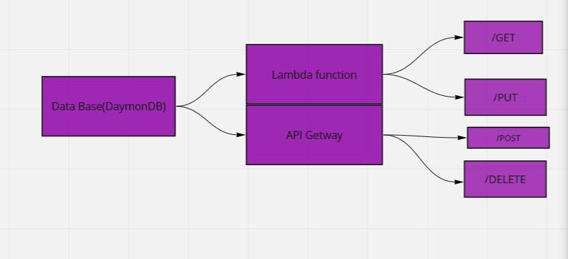

# serverless-api

## GitHub repo

https://github.com/baraahalomari/serverless-api

## PR

## Feature Tasks

> Create a single resource REST API using a domain model of your choosing, constructed using AWS Cloud Services.

## Routes: API Gateway

* POST: /people
* GET: /people and /people/{id}
* PUT: /people/{id}
* DELETE: /people/{id}

Root URL:

**Outputs:** 

* GET: returns objects from database (all or specific id)
* POST: returns object just added
* PUT: returns updated object
* DELETE: returns empty object

## UML Diagram

